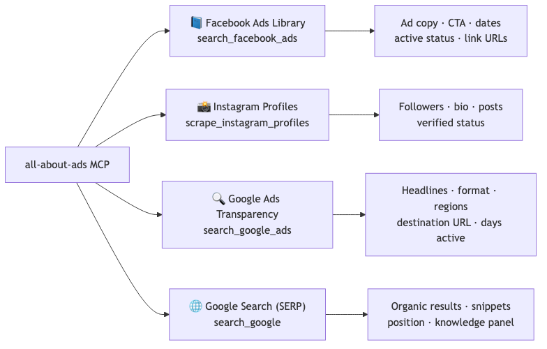
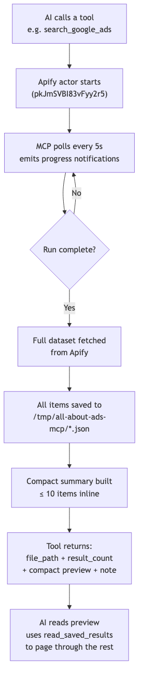
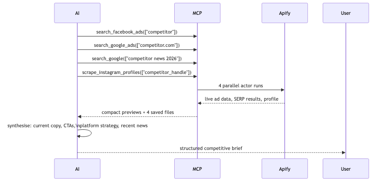
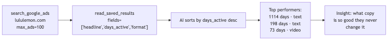
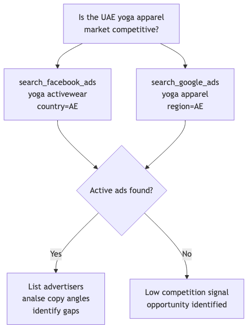
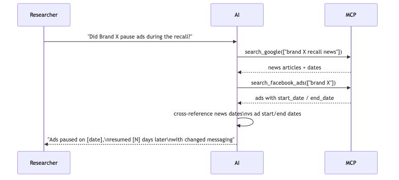
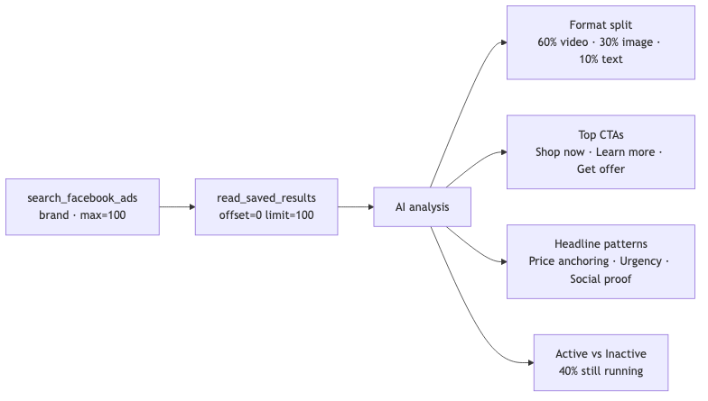
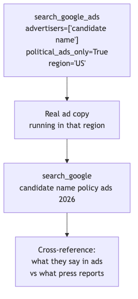
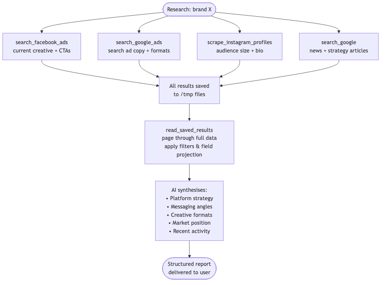

# all-about-ads-mcp

An MCP (Model Context Protocol) server that gives AI agents **live, structured ad intelligence** across Facebook, Google, and Instagram — data that no base model can produce from training alone.

Powered by [Apify](https://apify.com/) actors. Works with any MCP-compatible client: Cursor, Claude, etc.

---

## Demo


---

## Why this MCP exists

A base AI model can tell you what lululemon's *general* marketing strategy looks like — based on articles it was trained on, months ago. It cannot tell you:

- What ad copy is running **right now** on Facebook or Google
- Whether a competitor **started or stopped** a campaign last week
- Which **countries** a brand is targeting today
- How long a specific ad has been active (`days_active`)

This MCP fetches **live truth**, not remembered facts.

| Capability | Base AI | This MCP + AI |
|---|---|---|
| Brand's current ad copy | Guesses from old training | Live, exact headlines |
| Ad volume for analysis | 1–3 examples at best | 10–100+ per run |
| Cross-platform in one session | Impossible | FB + Google + IG + SERP |
| Time an ad has been running | Unknown | Exact (`days_active` field) |
| New market ad landscape | Outdated | Real-time, filterable by country |
| Verify if brand is advertising | Assumption | Confirmed fact |
| Research speed | One query at a time | Tools run in parallel — hundreds of ads across platforms in minutes |

---

## Platform coverage



---

## How results are handled

Tools run in parallel — an AI agent can fire off Facebook, Google, and Instagram scrapers simultaneously rather than waiting for each one to finish before starting the next. That's why a full multi-platform research session completes in minutes, not hours.

Scraper runs take 30 seconds to a few minutes. Raw payloads can be enormous, so the architecture keeps the AI's context window safe:



Full results are never sent to the model in one shot. The preview gives enough signal; `read_saved_results` provides paginated, filterable access to the rest.

---

## Use cases

### 1. Competitive intelligence before a pitch

An agency pitching a new client can build a full picture in minutes instead of days:



No base AI can give you what's *actually running today* across all three platforms simultaneously.

---

### 2. Evergreen ad detection

The `days_active` field in Google Ads shows exactly how long each creative has been live. An ad running for **1,000+ days** is a proven, high-converting asset. Use this to find what competitors refuse to turn off:



---

### 3. Market entry gap analysis

Before entering a new market, check who's already advertising there:



A base AI would guess based on 2023 data. This gives real-time confirmation.

---

### 4. PR crisis correlation

When a brand faces a scandal, do they pull ads or keep running? Track it in real time:



---

### 5. Ad creative pattern analysis at scale

Pull 100 ads from a fast-growing brand and let the AI find the formula:



This requires structured bulk data to reason over — not 3 examples recalled from training.

---

### 6. Political ad transparency

Track political advertising by region with verifiable, primary-source data:



---

### 7. Full brand research loop

The complete workflow an AI agent can run autonomously:



---

## Project layout

```
all-about-ads-mcp/
├── src/
│   ├── server.py      # FastMCP server instance
│   ├── tools.py       # 6 MCP tool definitions
│   ├── storage.py     # Result persistence + per-platform summarisers
│   └── resources.py   # ads://about resource
├── main.py            # Entry point (stdio transport)
├── pyproject.toml
└── uv.lock
```

---

## Setup

**1. Install dependencies:**
```bash
uv sync
```

**2. Configure your Apify API token:**
```bash
cp .env.example .env
# edit .env and set APIFY_API_TOKEN=<your token>
```

Get a free token at [apify.com](https://apify.com) — the free tier covers light research use.

---

## Connecting MCP clients

### Claude Desktop

Edit `~/Library/Application Support/Claude/claude_desktop_config.json` (Mac) or `%APPDATA%\Claude\claude_desktop_config.json` (Windows):

```json
{
  "mcpServers": {
    "all-about-ads": {
      "command": "uv",
      "args": ["run", "--directory", "/absolute/path/to/all-about-ads-mcp", "main.py"],
      "env": {
        "APIFY_API_TOKEN": "your_apify_token_here"
      }
    }
  }
}
```

### Cursor

Add to `~/.cursor/mcp.json` (global) or `.cursor/mcp.json` (per-project):

```json
{
  "mcpServers": {
    "all-about-ads": {
      "command": "uv",
      "args": ["run", "--directory", "/absolute/path/to/all-about-ads-mcp", "main.py"],
      "env": {
        "APIFY_API_TOKEN": "your_apify_token_here"
      }
    }
  }
}
```

### Windsurf

Edit `~/.codeium/windsurf/mcp_config.json`:

```json
{
  "mcpServers": {
    "all-about-ads": {
      "command": "uv",
      "args": ["run", "--directory", "/absolute/path/to/all-about-ads-mcp", "main.py"],
      "env": {
        "APIFY_API_TOKEN": "your_apify_token_here"
      }
    }
  }
}
```

### VS Code (with GitHub Copilot)

Add to your `.vscode/mcp.json` in the workspace root:

```json
{
  "servers": {
    "all-about-ads": {
      "type": "stdio",
      "command": "uv",
      "args": ["run", "--directory", "/absolute/path/to/all-about-ads-mcp", "main.py"],
      "env": {
        "APIFY_API_TOKEN": "your_apify_token_here"
      }
    }
  }
}
```

### Docker (any client)

If you prefer not to install Python/uv locally, run the pre-built container. The container communicates over stdio just like the native install:

**Build the image:**
```bash
docker build -t all-about-ads-mcp .
```

**Claude Desktop / Cursor / Windsurf config:**
```json
{
  "mcpServers": {
    "all-about-ads": {
      "command": "docker",
      "args": ["run", "--rm", "-i", "-e", "APIFY_API_TOKEN", "all-about-ads-mcp"],
      "env": {
        "APIFY_API_TOKEN": "your_apify_token_here"
      }
    }
  }
}
```

> **`-i` is required** (stdin must stay open for stdio transport). Do not use `-t` (no TTY needed).

---

## Publishing to MCP directories

### Smithery

[Smithery](https://smithery.ai) reads the `smithery.yaml` in this repo automatically. To publish:

1. Push this repo to GitHub
2. Go to [smithery.ai](https://smithery.ai) → **Submit a server** → paste your GitHub URL
3. Smithery reads `smithery.yaml` and handles deployment — users configure their `APIFY_API_TOKEN` in the Smithery UI

### Glama

[Glama](https://glama.ai/mcp/servers) indexes public GitHub repos. To publish:

1. Push this repo to GitHub (public)
2. Go to [glama.ai/mcp/servers](https://glama.ai/mcp/servers) → **Add Server** → paste your GitHub URL

### mcpservers.org

[mcpservers.org](https://mcpservers.org) is a community directory. To submit:

1. Push to GitHub
2. Go to [mcpservers.org/submit](https://mcpservers.org/submit) and fill in the form

---

---

## Tools

### `search_facebook_ads`
Search the Facebook (Meta) Ads Library by keyword or brand name.

| Parameter | Type | Default | Description |
|---|---|---|---|
| `search_queries` | `list[str]` | required | Keywords or brand names |
| `max_results_per_query` | `int` | `10` | Min 10 (actor limit) |
| `enrich_with_ad_details` | `bool` | `false` | Extra per-ad details (slower) |
| `sort_by` | `str` | `SORT_BY_TOTAL_IMPRESSIONS` | Or `SORT_BY_RELEVANCY_MONTHLY_GROUPED` |
| `country` | `str \| null` | `null` | ISO code e.g. `"US"`, `"IN"`, or `"ALL"` |
| `content_languages` | `list[str] \| null` | `null` | e.g. `["en"]` |
| `publisher_platforms` | `list[str] \| null` | `null` | e.g. `["facebook", "instagram"]` |
| `active_status` | `str` | `ALL` | `ALL`, `ACTIVE`, `INACTIVE` |
| `ad_type` | `str` | `ALL` | `ALL`, `POLITICAL_AND_ISSUE_ADS`, `HOUSING_ADS`, `EMPLOYMENT_ADS`, `CREDIT_ADS` |
| `media_type` | `str` | `ALL` | `ALL`, `IMAGE`, `MEME`, `VIDEO`, `NONE` |
| `start_date` / `end_date` | `str \| null` | `null` | `YYYY-MM-DD` |

Returns: `file_path`, `result_count`, `queries`, `ads` (compact preview)

---

### `search_google_ads`
Search the Google Ads Transparency Center — covers Search, Display, YouTube, and Shopping ads.

| Parameter | Type | Default | Description |
|---|---|---|---|
| `advertisers` | `list[str]` | required | Brand names, domains (`"nike.com"`), full URLs, or advertiser IDs (`"AR..."`) |
| `max_ads_per_advertiser` | `int` | `100` | `0` = unlimited |
| `start_date` / `end_date` | `str \| null` | `null` | `YYYY-MM-DD` |
| `region` | `str \| null` | `null` | 2-letter ISO code e.g. `"US"`, `"GB"` |
| `political_ads_only` | `bool` | `false` | Restrict to political/election ads |

Returns: `file_path`, `result_count`, `advertisers`, `ads` (compact preview with `days_active`, `headline`, `format`, `regions`, `destination_url`)

---

### `scrape_instagram_profiles`
Scrape public Instagram profile data.

| Parameter | Type | Default | Description |
|---|---|---|---|
| `profiles` | `list[str]` | required | Instagram usernames e.g. `["natgeo", "nike"]` |
| `include_recent_posts` | `bool` | `true` | Also fetch recent posts |

Returns: `file_path`, `result_count`, `profiles` (compact preview with followers, bio, verified status)

---

### `search_google`
Search Google for organic results — use for brand research, news, and context about ads you've discovered.

| Parameter | Type | Default | Description |
|---|---|---|---|
| `queries` | `list[str]` | required | Search queries |
| `max_pages_per_query` | `int` | `1` | Each page ≈ 10 results |
| `results_per_page` | `int` | `10` | Range: 10–100 |
| `country_code` | `str \| null` | `null` | e.g. `"gb"` → google.co.uk |
| `search_language` | `str \| null` | `null` | e.g. `"en"`, `"fr"` |
| `quick_date_range` | `str \| null` | `null` | `d10`, `w2`, `m6`, `y1` |

Returns: `file_path`, `result_count` (individual URLs), `queries`, `results` (compact preview)

---

### `list_saved_results`
List all previously saved result files with path, size, item count, tool name, and queries. No Apify call — instant.

---

### `read_saved_results`
Read a slice of items from a saved file — fast access without re-running scrapers.

| Parameter | Type | Default | Description |
|---|---|---|---|
| `file_path` | `str` | required | Path or bare filename from `list_saved_results` |
| `offset` | `int` | `0` | First item index |
| `limit` | `int` | `5` | Max items to return |
| `fields` | `list[str] \| null` | `null` | Project only these top-level keys |
| `query` | `str \| null` | `null` | Case-insensitive substring filter across item JSON |

---

## Resources

- `ads://about` — full parameter reference for all tools, readable by the AI agent at session start.
